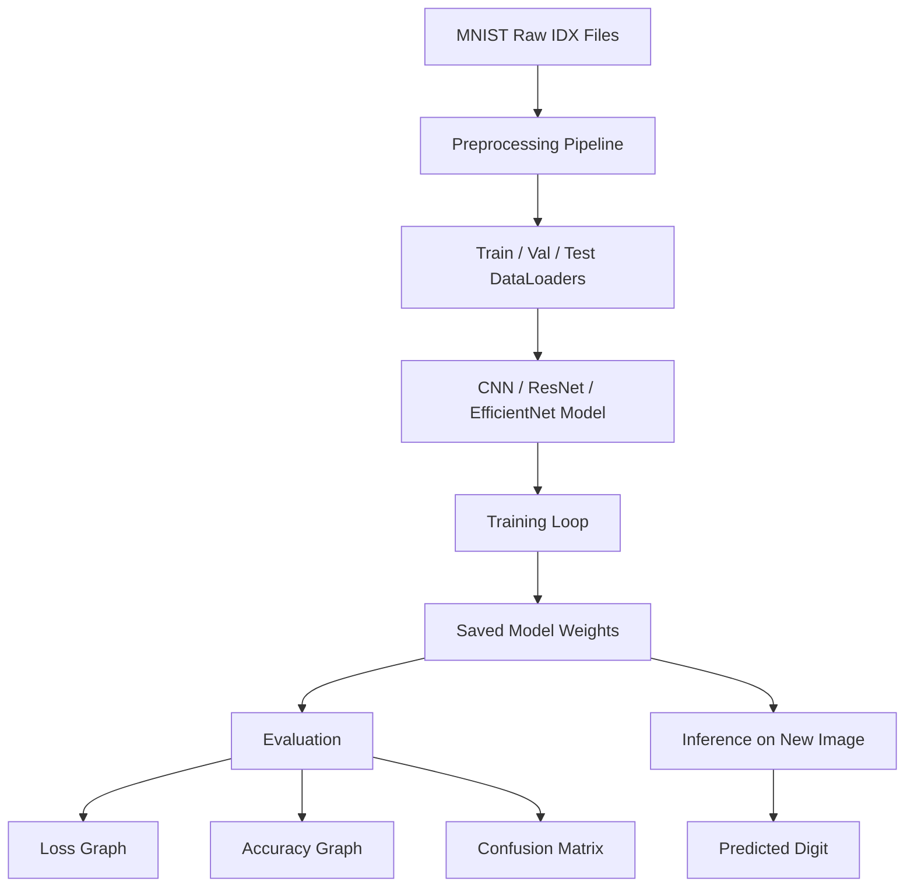

# MNIST CNN Digit Recognition Project

This project is a complete deep learning pipeline for handwritten digit recognition using the MNIST dataset.

It covers the full machine learning workflow:

1. load and preprocess MNIST data
2. build and train a CNN model
3. evaluate the model with accuracy, loss, and confusion matrix
4. save the trained weights
5. run inference on a new handwritten image
6. compare CNN with ResNet and EfficientNet for FYP-level experimentation

---

## Project Goal

The goal of this project is to classify handwritten digits from `0` to `9` using deep learning.

The model takes a grayscale image of a digit and predicts which number it represents.

This is a classic computer vision problem and is ideal for learning the complete ML pipeline because it is simple enough to run quickly, but still demonstrates real concepts such as:

- data loading
- preprocessing
- model architecture design
- training with backpropagation
- evaluation
- inference
- visualization

---

## How the Project Works

Here is the full flow of the system:



### In simple words

- The raw MNIST files are read from the `dataset/raw` folder.
- The preprocessing code converts them into PyTorch dataloaders.
- The model learns patterns like edges, strokes, and curves.
- Training updates the weights using backpropagation and Adam optimizer.
- Evaluation checks how well the model performs on unseen data.
- Inference lets you upload a digit image and get a prediction.

---

## Why CNN Works Well for Digits

A Convolutional Neural Network is better than a normal fully connected network for images because:

- it preserves spatial structure
- it learns local patterns using filters
- it uses fewer parameters than a dense network
- it is more effective for images, edges, and shapes

For handwritten digits, CNNs are especially strong because digits are made of simple visual patterns that convolution layers can learn very well.

---

## Folder Structure

```text
project/
├── dataset/
│   ├── raw/
│   ├── processed/
│   └── splits/
├── evaluation/
├── inference/
├── model/
├── preprocessing/
├── training/
│   └── checkpoints/
├── main.py
├── mnist_cnn.pth
├── requirements.txt
└── README.md
```

### What each folder does

- `dataset/raw/` stores the original MNIST IDX files.
- `dataset/processed/` can be used for cleaned or transformed data.
- `dataset/splits/` can store saved train/validation/test splits if needed.
- `preprocessing/` contains code for loading and preparing the raw data.
- `model/` contains the CNN, ResNet, and EfficientNet model definitions.
- `training/` contains the training loop, loss function, and graph plotting utility.
- `evaluation/` contains accuracy, loss, and confusion-matrix logic.
- `inference/` contains prediction helpers for new images.
- `training/checkpoints/` stores the best checkpoint during training.
- `main.py` is the command-line entry point.

---

## Data Format

The dataset used here is MNIST in IDX format.

The raw files should be placed inside:

```text
project/dataset/raw/
```

The project expects these files:

- `train-images.idx3-ubyte`
- `train-labels.idx1-ubyte`
- `t10k-images.idx3-ubyte`
- `t10k-labels.idx1-ubyte`

If the files are inside a subfolder, the preprocessing code will search recursively.

---

## Preprocessing

The preprocessing pipeline is in [preprocessing/prepare_data.py](preprocessing/prepare_data.py).

It does the following:

- reads raw MNIST images and labels
- normalizes pixel values to the range `0` to `1`
- reshapes images to `1 x 28 x 28`
- splits the training set into train and validation subsets
- creates PyTorch `DataLoader` objects

### Output of preprocessing

After preprocessing, the model receives batches like:

- images: `[batch_size, 1, 28, 28]`
- labels: `[batch_size]`

---

## Models

This project supports three models:

### 1. CNN

The default model. It is small, fast, and good for MNIST.

### 2. ResNet

A deeper residual network that often trains better than plain CNNs.

### 3. EfficientNet

A modern architecture that is efficient and strong for image tasks.

You can compare them using the `--model` option.

---

## Training

Training is handled by `training/train.py` and launched through `main.py`.

### What training does

- sends data through the model
- computes loss using cross-entropy
- performs backpropagation
- updates weights with Adam optimizer
- evaluates on validation data after each epoch
- saves the best checkpoint
- saves the final model
- stores training history
- creates learning curve plots

### Train command

```powershell
py project/main.py --mode train --epochs 5 --model cnn
```

You can also try:

```powershell
py project/main.py --mode train --epochs 5 --model resnet
py project/main.py --mode train --epochs 5 --model efficientnet
```

### Files saved after training

- `project/training/checkpoints/best_model.pt`
- `project/mnist_cnn.pth`
- `project/training/training_history.json`
- `project/training/learning_curves.png`

---

## Evaluation

Evaluation is handled by `evaluation/evaluate.py`.

It computes:

- test loss
- test accuracy
- confusion matrix

### Evaluation command

```powershell
py project/main.py --mode evaluate --model cnn
```

This will also save the confusion matrix image.

### Confusion matrix output

The confusion matrix shows which digits the model confuses most often.

For example, the model may mix up:

- `4` and `9`
- `3` and `5`
- `7` and `1`

That kind of analysis is useful for your FYP report.

---

## Inference / Prediction

Prediction is handled by `inference/predict.py`.

This is the most important real-world feature of the project.

### What it does

- takes a new image from the user
- converts it to grayscale
- resizes it to `28 x 28`
- normalizes it
- feeds it into the trained model
- prints the predicted digit
- prints class probabilities

### Prediction command

```powershell
py project/main.py --mode predict --image path\to\digit.png --model cnn
```

### Example result

```text
Predicted digit: 7
Class probabilities:
	0: 0.0012
	1: 0.0021
	2: 0.0008
	3: 0.0005
	4: 0.0009
	5: 0.0016
	6: 0.0020
	7: 0.9898
	8: 0.0007
	9: 0.0004
```

---

## Visualization

This project generates useful visuals for a report or FYP presentation.

### 1. Loss graph

Shows how training loss and validation loss change across epochs.

### 2. Accuracy graph

Shows how training accuracy and validation accuracy change across epochs.

### 3. Confusion matrix

Shows which digits are predicted correctly and which are confused.

### Plot command

```powershell
py project/training/plot_curves.py
```

### Saved visual files

- `project/training/learning_curves.png`
- `project/evaluation/confusion_matrix.png`

---

## Model Comparison

You can compare performance across architectures using:

- `cnn`
- `resnet`
- `efficientnet`

### Why this is useful

This gives you a stronger FYP story because you are not just training one model.
You are comparing multiple architectures and analyzing which one performs best on MNIST.

### Suggested experiment commands

```powershell
py project/main.py --mode train --epochs 5 --model cnn
py project/main.py --mode train --epochs 5 --model resnet
py project/main.py --mode train --epochs 5 --model efficientnet
```

Then compare:

- training loss
- validation loss
- test accuracy
- confusion matrix
- training speed

---

## How to Run the Project

### 1. Install dependencies

```powershell
pip install -r project/requirements.txt
```

### 2. Train the model

```powershell
py project/main.py --mode train --epochs 5 --model cnn
```

### 3. Evaluate the model

```powershell
py project/main.py --mode evaluate --model cnn
```

### 4. Plot the training curves

```powershell
py project/training/plot_curves.py
```

### 5. Predict a new digit image

```powershell
py project/main.py --mode predict --image path\to\image.png --model cnn
```

---

## Important Notes

- The project expects handwritten digit images.
- MNIST images are grayscale.
- Images should be roughly centered for best prediction results.
- For best comparison, train all models with the same number of epochs.
- If you change the dataset or image size, you may need to adjust preprocessing and model input layers.

---

## What Makes This a Good FYP Project

This project is suitable for an FYP because it includes:

- a complete end-to-end ML pipeline
- multiple model architectures
- training and validation tracking
- visual analysis with graphs and confusion matrix
- inference on new user images
- saved checkpoints and final model weights

It is not just a demo; it is a structured deep learning system.

---

## Files of Interest

- [main.py](main.py)
- [preprocessing/prepare_data.py](preprocessing/prepare_data.py)
- [model/cnn.py](model/cnn.py)
- [training/train.py](training/train.py)
- [training/plot_curves.py](training/plot_curves.py)
- [evaluation/evaluate.py](evaluation/evaluate.py)
- [evaluation/metrics.py](evaluation/metrics.py)
- [inference/predict.py](inference/predict.py)
- [inference/utils.py](inference/utils.py)

---

## Summary

This project shows the full machine learning lifecycle:

data preparation → model building → training → evaluation → visualization → prediction.

If you want a simple one-line summary for a presentation, you can say:

> This project uses a CNN-based deep learning pipeline to classify handwritten digits from MNIST, compare multiple architectures, and visualize model performance with graphs and a confusion matrix.
# MNIST CNN Project

This project is a complete deep learning workflow for handwritten digit recognition using a Convolutional Neural Network (CNN) and the MNIST dataset.

## What it does

- loads MNIST raw IDX files from `project/dataset/raw`
- creates training, validation, and test loaders
- trains a CNN to classify digits `0-9`
- evaluates the trained model on the test split
- runs inference on a custom image file

## Project structure

- `preprocessing/prepare_data.py` - reads the raw MNIST files and builds dataloaders
- `model/cnn.py` - defines the CNN architecture
- `training/train.py` - training loop and checkpoint saving
- `evaluation/evaluate.py` - validation/test evaluation
- `inference/predict.py` - predicts a digit from a single image
- `main.py` - command line entry point

## Setup

Install dependencies:

```bash
pip install -r project/requirements.txt
```

## Run training

```bash
py project/main.py --mode train --epochs 5
```

## Run evaluation

```bash
py project/main.py --mode evaluate
```

## Run inference

```bash
py project/main.py --mode predict --image path/to/digit.png
```

## Notes

- The model expects grayscale handwritten digit images.
- During inference, the image is resized to `28x28` and normalized before prediction.
